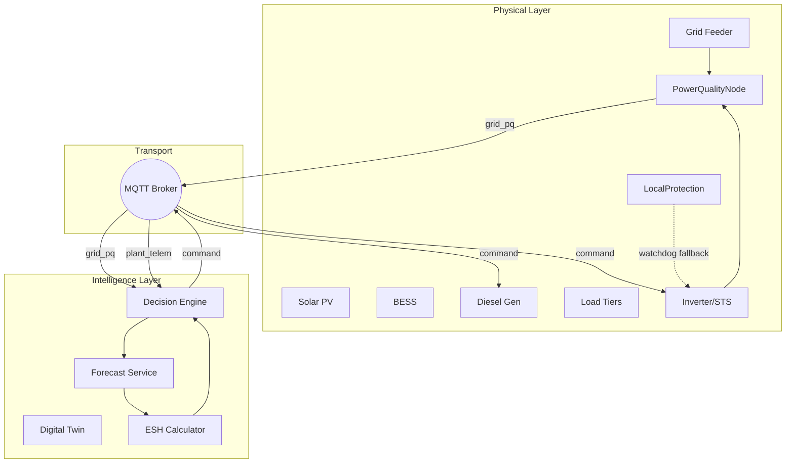

```mermaid
graph TD
    subgraph Physical Layer
        Feeder[Grid Feeder]
        Solar[Solar PV]
        Battery[BESS]
        Generator[Diesel Gen]
        Loads[Load Tiers]
        Inverter[Inverter/STS]
        PQ[PowerQualityNode]
        LP[LocalProtection]
    end

    subgraph Transport
        Broker((MQTT Broker))
    end

    subgraph Intelligence Layer
        DE[Decision Engine]
        DT[Digital Twin]
        FS[Forecast Service]
        ESH[ESH Calculator]
    end

    PQ -->|grid_pq| Broker
    Feeder --> PQ
    Inverter --> PQ
    
    Broker -->|grid_pq| DE
    Broker -->|plant_telem| DE
    
    DE --> FS
    FS --> ESH
    ESH --> DE
    
    DE -->|command| Broker
    Broker -->|command| Inverter
    Broker -->|command| Generator
    
    LP -.->|watchdog fallback| Inverter
```
